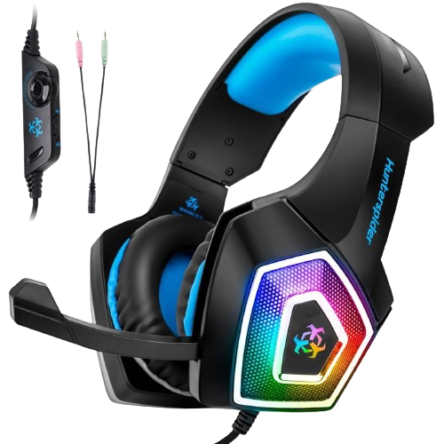

>The problem is that Steve Jobs died before he could take on gaming.

Gaming hardware seems stuck in a time warp of flashy, superficial designs while mobile devices have transformed from cheap, plasticky gadgets into sleek, sophisticated tools. It's as if the gaming industry missed the memo on elegant design that Apple sent out years ago.

Take a stroll through any electronics store, and you'll find yourself assaulted by a cacophony of RGB lights and angular plastic monstrosities masquerading as "gaming" gear. It's like walking into a rave hosted by a bunch of Transformers with questionable taste. From keyboards that look like they've been vomited on by a rainbow, to mice that appear ready for interstellar warfare, the "gamer" aesthetic is about as subtle as a shotgun blast.

Why is it that anything branded as "gamer" seems to cater to a taste for neon kitsch and over-the-top cyberpunk nonsense? Speaking of headsets, they look like they were designed by Michael Bay during a fever dream.

<figure>
    <figcaption><i>This headset pretty much offends me.</i></figcaption>
</figure>

Let's take a moment to appreciate the irony: for a group often stereotyped as homophobic, the gamer aesthetic sure is obsessed with the rainbow.

And it's not just peripherals. Motherboards, graphics cards, RAM sticks - even chairs, for Christ's sake - are all infected with this visual virus. Razer seems to be operating under the design philosophy of "What if Tron and a tribal tattoo had a baby?" Meanwhile, brands like HyperX, although more subtle, slap "HyperX" on everything in a font that looks like it's trying to stab your eyes.

Now, I see why manufacturers would do this. It's all about making a statement of power and boldness, appealing to those who view gaming as a rebellious, flashy subculture. For some, this aesthetic might be "badass." But for many, myself include, it's just bad taste and design.

That said, I acknowledge that taste is subjective. Some people genuinely enjoy this aesthetic, and that's fine. It's just a bit of fun, right? And let's be honest, if you're the type who thinks having "PREDATOR" adorned across your PC in giant letters is cool, who am I to judge?

For those of us who prefer our tech to look like it belongs in this century rather than in a 90s hacker movie, there are options. You can build your own PC, choosing components based on performance rather than how many lights they have. There are brands that offer more understated designs - think of them as the Mercedes-Benz of the PC world.

Ultimately, it's clear that this is a culture I don't understand - and likely never will. But perhaps that's okay. After all, if we all liked the same things, the world would be a rather boring place. A less visually offensive place, perhaps, but boring nonetheless.
